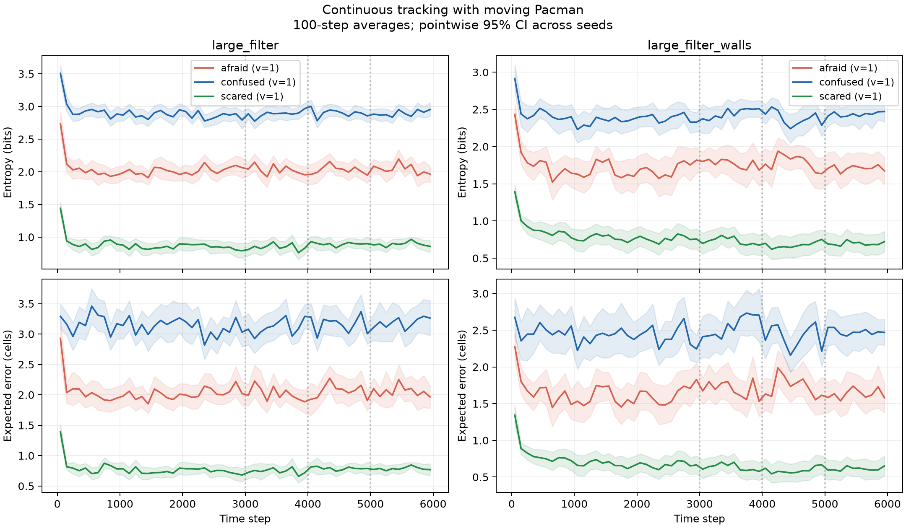
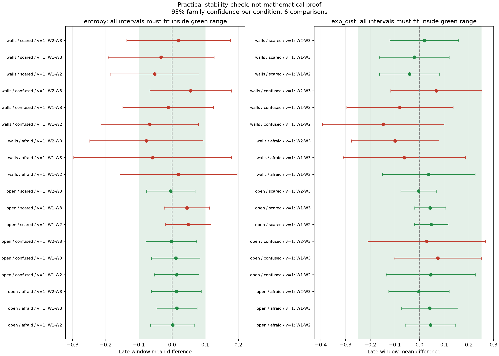

# ผลตรวจความคงที่ของ Project 2

> อัปเดต 4 ตุลาคม 2026: อาจารย์ยกเลิกข้อ 3.c ทั้งข้อ รวมกราฟ, error bars
> และชุดทดลองเพื่อแสดงการลู่เข้าของตัวชี้วัด เอกสารนี้เป็นผลตรวจภายในเดิม
> ไม่ใช่รายการงานที่ต้องผ่านก่อนส่ง ไม่ต้องเพิ่มตาหรือ seeds เพื่อผ่านเกณฑ์นี้
> ข้อ 2.a ยังอยู่ตาม [README ปัจจุบัน](../README.md) ข้อมูลและผลเดิมคงไว้สำหรับอ้างอิง

วันที่ 3 ตุลาคม 2026 — ผลทดลองใหม่ครบตามแผน [CONVERGENCE_PLAN.md](CONVERGENCE_PLAN.md)

## ผลที่สรุปได้

การติดตามต่อเนื่อง 6,000 ตา × 30 seeds ต่อเงื่อนไข พบว่า
**large_filter + afraid + variance 1 ผ่านเกณฑ์ความคงที่ของค่าเฉลี่ยช่วงท้าย**
ทั้ง entropy และ expected-distance error อีก 5 เงื่อนไขยังยืนยันไม่ได้
เพราะช่วงความเชื่อมั่นกว้างเกินขอบเขตที่กำหนด ไม่พบคู่เปรียบเทียบที่ช่วง
ความเชื่อมั่นไม่คร่อมศูนย์ในกลุ่มที่ไม่ผ่าน แต่การไม่พบความแตกต่าง
ไม่ได้แปลว่าพิสูจน์แล้วว่าคงที่

นี่เป็นหลักฐานเชิงทดลองภายใต้ protocol ที่ระบุด้านล่าง ไม่ใช่การพิสูจน์
belief ลู่เข้าทางคณิตศาสตร์ และยังไม่ครบหลักฐานการลู่เข้าของเกมปกติทุกเงื่อนไข
จบการตรวจที่ 6,000 ตาตามแผน ไม่ปรับเกณฑ์เพื่อให้ผ่าน

## สิ่งที่แก้ในโค้ด

- เร่ง transition ด้วย vectorization และ cache ไม่เกิน 8 matrices;
  prediction คำนวณเฉพาะ transition ที่มีโอกาสเกิดจริง และ cache ค่า Binomial PMF
  โดยใช้ความน่าจะเป็นเดิม ไม่ลด noise หรือเปลี่ยนพฤติกรรมผี
- `_get_updated_belief` ยังเรียก `_get_transition_model` และ `_get_sensor_model`
  ตามโจทย์ ไม่แก้เมธอดและตัวแปรที่โจทย์ห้ามแก้
- ตัวรันเกมบันทึกจำนวนตาจริงและเหตุผลที่จบ ป้องกันเขียนทับข้อมูลเดิม
- เพิ่มตัวรันติดตามต่อเนื่อง ตัวตรวจความคงที่ และกราฟพร้อมช่วงความเชื่อมั่น

ทดสอบผ่าน 17 ข้อ: โมเดล 9 ข้อ การตรวจความคงที่ 6 ข้อ และ standalone imports
2 ข้อ โมเดล posterior เทียบสมการ dense ผ่านทั้ง 3 ghost policies และ Pacman
ที่ขยับตำแหน่ง ตรวจ PMF เทียบ SciPy รวม support boundaries และ noise สูง
PEP8 และ syntax ผ่าน โค้ดเมธอดที่ห้ามแก้เทียบ AST กับ commit เดิมแล้วเหมือนเดิม
ข้อมูล 200 ตาแรกของเกมใหม่ทั้ง 20 รอบตรงกับข้อมูลเดิมภายใน 1e-6

## เกณฑ์และความหมายของการลู่เข้า

ผีและ Pacman ยังเคลื่อนที่และมี sensor noise ดังนั้น belief ไม่จำเป็นต้อง
หยุดเปลี่ยนหรือ error ลดเหลือศูนย์ สิ่งที่ตรวจนี้คือค่าเฉลี่ย entropy
และ error ในช่วงท้ายยังเปลี่ยนมากเกินขอบเขตที่ยอมรับหรือไม่
entropy วัดความไม่แน่ใจของ belief; error คือระยะ Manhattan จากตำแหน่งผีจริง
เฉลี่ยตามความน่าจะเป็นใน belief

กำหนดก่อนอ่านผลใหม่: entropy ต่างได้ไม่เกิน ±0.10 bits และ error
ไม่เกิน ±0.25 ช่อง เป็นเกณฑ์เชิงปฏิบัติของการตรวจนี้ ไม่ใช่เกณฑ์อาจารย์
แบ่งครึ่งท้ายเป็น 3 windows เทียบทุก 3 คู่ × 2 metrics = 6 comparisons
ต่อเงื่อนไข ใช้ paired differences ข้าม seeds และ Student-t intervals
ปรับ Bonferroni ให้ family confidence 95% ภายในเงื่อนไขของ stage นั้น
เป็นการประมาณเชิงสถิติ ไม่รับรองพร้อมกันทุกเงื่อนไขและทุก stage
ไม่ถือแต่ละตาซึ่งสัมพันธ์กันเป็นตัวอย่างอิสระ

ต้องมีข้อมูลครบทุก seed และ CI ทั้ง 6 อันอยู่ภายในขอบเขตจึงผ่าน
สำหรับ 6,000 ตา windows คือ t=3000–3999, 4000–4999 และ 5000–5999

## ข้อมูลและผลแต่ละชุด

| ชุด | รอบที่ครบระยะ / ทั้งหมด | คู่เปรียบเทียบที่ผ่าน / ทั้งหมด | ข้อสรุป |
|---|---:|---:|---|
| ข้อมูลเดิม 200 ตา | 180/180 | 6/108 | ยังไม่มีเงื่อนไขผ่านครบ 6 คู่ |
| ข้อมูลเดิม 1,000 ตา | 20/20 | 0/12 | ยังยืนยันไม่ได้ |
| เกมปกติ 3,000 ตา | 14/20 | 0/12 | มีเกมจบก่อน จึงไม่ผ่านเกณฑ์ข้อมูลครบ |
| ติดตามต่อเนื่อง 3,000 ตา | 180/180 | 9/36 | ยังไม่มีเงื่อนไขผ่านครบ 6 คู่ |
| ติดตามต่อเนื่อง 6,000 ตา | 180/180 | 18/36 | ผ่านครบ 1 จาก 6 เงื่อนไข |

ชุดเดิมไม่มี protocol metadata แบบใหม่ จึงแยกไว้เป็นข้อมูลประวัติ
ชุดเกมใหม่ใช้ confused/large_filter_walls, variance 1 และ 4, seeds 0–9
ที่ seed 1, 5, 6 เกมจบหลัง 2,342, 1,838, 2,622 ตาตามลำดับ ทั้งสอง variances
ไม่คัดเฉพาะเกมที่อยู่รอดมาสรุปว่านิ่ง ตัวเดินเกมเดิมอ่านตำแหน่งผีเพื่อพยายาม
หลบผี จึงไม่ได้ใช้ผลนี้อ้างความสำเร็จของเอเจนต์โบนัส

การติดตามต่อเนื่องใช้ทั้งสอง layouts และทั้งสาม ghost policies,
variance 1, **ผี 1 ตัว**, seeds 0–29 ผีเดินด้วย policy ของโจทย์ เซนเซอร์ใช้
centered Binomial เดิม Pacman เดินสุ่มจาก legal actions โดยไม่อ่านตำแหน่งผี
อนุญาตชนกันโดยไม่จบการติดตาม เพื่อเก็บครบระยะ Ghost moves → evidence/update
→ วัด metrics → Pacman moves ผล 3,000 และ 6,000 ใช้ seeds เดิม จึงไม่ใช่
สองชุดอิสระที่จะนำมารวมเพิ่มขนาดตัวอย่าง

**การทดลองนี้เป็นหลักฐานเสริม ไม่ใช้แทนเกมปกติหรือผลโบนัส** ยังไม่ได้
รับรองทุก variance หรือการลู่เข้าของกรณีหลายผี แม้โค้ด filter รองรับหลายผี

| Layout | ผี | ผ่านที่ 3,000 ตา / 6 | ผ่านที่ 6,000 ตา / 6 | ผลสุดท้าย |
|---|---|---:|---:|---|
| large_filter | afraid | 3 | 6 | ผ่านตามเกณฑ์ |
| large_filter | confused | 0 | 4 | ยังยืนยันไม่ได้ |
| large_filter | scared | 3 | 4 | ยังยืนยันไม่ได้ |
| large_filter_walls | afraid | 0 | 1 | ยังยืนยันไม่ได้ |
| large_filter_walls | confused | 0 | 0 | ยังยืนยันไม่ได้ |
| large_filter_walls | scared | 3 | 3 | ยังยืนยันไม่ได้ |

27 คู่ที่ไม่ผ่านในชุด 3,000 ตาและ 18 คู่ที่ไม่ผ่านในชุด 6,000 ตาทั้งหมด
มีเหตุผล `interval_too_wide` การเพิ่มระยะช่วยบางเงื่อนไข แต่ไม่รับประกัน
ว่าทุกเงื่อนไขจะผ่าน หากทดลองต่อควรกำหนดแผนและงบใหม่ก่อนดูผล
รวมถึงจำนวน seeds เพิ่มเติม แทนการเพิ่มตาอย่างเดียวไปเรื่อย ๆ

ตัวอย่างที่ผ่าน large_filter/afraid: ช่วง CI ของ entropy ทั้ง 3 คู่
คือ [-0.0653, 0.0684], [-0.0462, 0.0750], [-0.0622, 0.0880] bits
และ error คือ [-0.0584, 0.1465], [-0.0725, 0.1552], [-0.1250, 0.1195] ช่อง
ทุกอันอยู่ในขอบเขตที่กำหนด

## กราฟและหลักฐานสำหรับพรีเซนต์



กราฟนี้เฉลี่ยครั้งละ 100 ตา เงาสีเป็น pointwise 95% CI ข้าม 30 seeds
ใช้แสดงการลดลงช่วงต้นและความผันผวนช่วงท้าย ไม่ใช้ตัดสินจากเส้นเรียบอย่างเดียว



จุดเป็นค่าต่างของค่าเฉลี่ยช่วงท้าย เส้นเป็น CI ที่ปรับ 6 comparisons แล้ว
พื้นเขียวเป็นขอบเขตยอมรับ เส้นทั้งเส้นต้องอยู่ในพื้นเขียวจึงผ่าน
สีแดงหมายถึงยังยืนยันไม่ได้ ไม่ได้หมายความว่าโค้ดผิด

ตัวอย่างคำอธิบายตอนพรีเซนต์:

> เราทดลองทั้งสองแผนที่และผีสามแบบ โดยให้ Pacman เคลื่อนที่และเก็บ 30 seeds
> ต่อเงื่อนไขถึง 6,000 ตา ในการติดตามต่อเนื่อง เราตรวจสามช่วงท้ายพร้อม
> ช่วงความเชื่อมั่น พบว่า large_filter กับ afraid ผ่านเกณฑ์ทั้งสองตัววัด
> อีกห้าเงื่อนไขยังมีความไม่แน่นอนมากเกินเกณฑ์ จึงยังไม่กล่าวว่าลู่เข้าทั้งหมด
> เกมปกติบางรอบจบก่อน จึงแยกผลเกมจากการทดลองติดตามต่อเนื่องนี้

ตารางตัวเลขเต็ม: [results.csv](stability_figs/tracking_6000/results.csv)
และ [check.json](stability_figs/tracking_6000/check.json)
รายละเอียดเกมที่จบก่อน: [trials.csv](stability_figs/gameplay_3000/trials.csv)
ข้อมูลดิบอยู่ใน `stability_gameplay_3000`, `stability_tracking_3000`
และ `stability_tracking_6000` ไม่สร้าง PDF

## รันซ้ำ

จาก root ใช้ environment ที่ติดตั้ง dependencies ใน `requirements.txt`:

```powershell
python -m unittest project2.check_models project2.test_convergence test_submission_imports
python -m project2.run_tracking_experiments --steps 6000 --trials 30 --out project2/new_tracking_6000
python project2/convergence_check.py --data project2/new_tracking_6000 --out project2/new_tracking_figs --steps 6000 --trials 30
python project2/plot_stability.py --data project2/new_tracking_6000 --report project2/new_tracking_figs/check.json --out project2/new_tracking_figs
```

ใช้ชื่อ output ใหม่เพื่อเก็บหลักฐานเดิมไว้ หรือ `--resume` เพื่อข้ามรอบที่
บันทึกครบแล้วใน protocol และระยะเดียวกัน การคำนวณ audit/กราฟจากข้อมูลที่
เก็บไว้ทำได้ทันทีโดยไม่ต้องรันเกมใหม่
